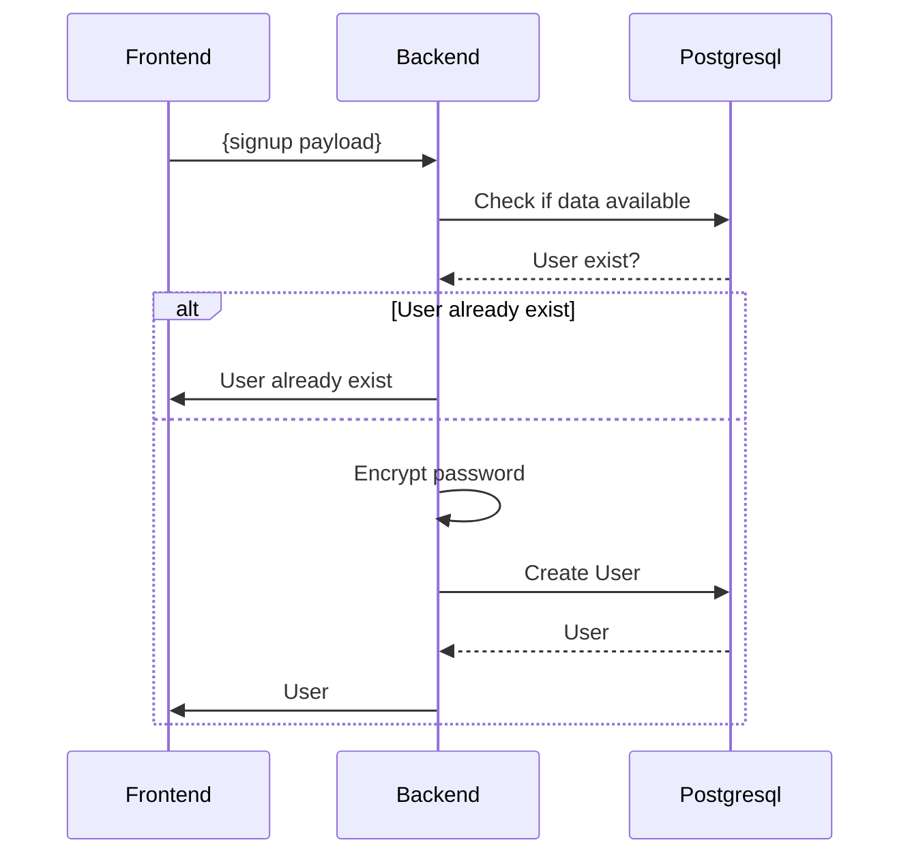
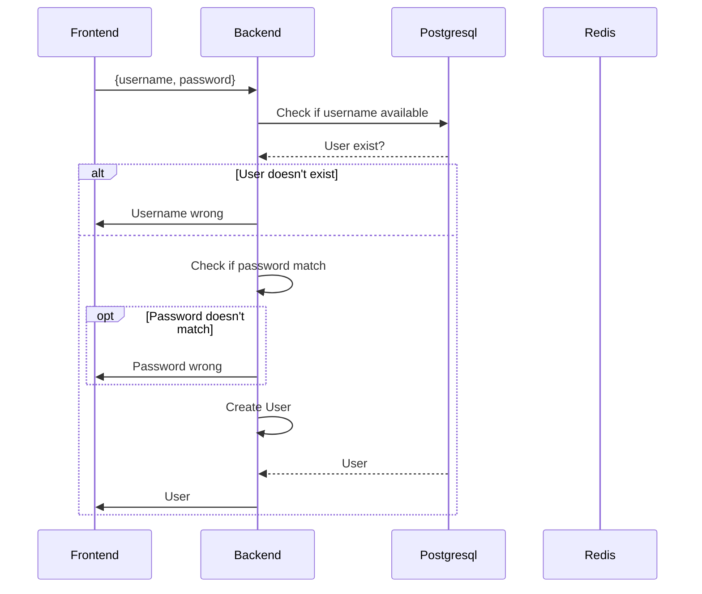

# 1. Register

```mermaid
sequenceDiagram
    participant A as Frontend
    participant B as Backend
    participant C as Postgresql

    A ->> B: {signup payload}
    B ->> C: Check if data available
    C -->> B: User exist?
    alt User already exist
        B ->> A: User already exist
    else
        B ->> B: Encrypt password
        B ->> C: Create User
        C -->> B: User
        B ->> A: User
    end
```

# 2. Login

```mermaid
sequenceDiagram
    participant A as Frontend
    participant B as Backend
    participant C as Postgresql
    participant D as Redis

    A ->> B: {username, password}
    B ->> C: Check if username available
    C -->> B: User exist?

    alt User doesn't exist
        B ->> A: Username wrong
    else
        B ->> B: Check if password match

        opt Password doesn't match
            B ->> A: Password wrong
        end


        B ->> B: Create User
        C -->> B: User
        B ->> A: User
    end
```
